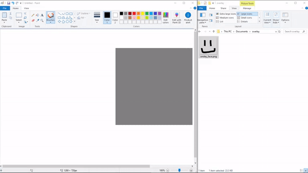

# Desktop-Image-Overlay
Drag-and-drop desktop application to overlay an image.

# Run

First, modify `config.json`:

```js
{
    "clickableToggleHotkey": "change this to the desired hotkey"
}
```

An example value could be "CommandOrControl+A". Refer to this link to help construct the string for the hotkey: https://electronjs.org/docs/api/accelerator

Run the node script:

```bash
npm install
npm start
```

\* note: I have not packaged the Electron application because I do not think it is necessary for the purpose of this application.

# Demo
Here is a demo of a possible use for this application:



What is happening:

1. an image is dragged into the application (this can be an image saved on your computer or an image from the web)

2. the application's window is resized

3. the window is moved by clicking and dragging the top region of the application's window

4. the image dragged into the application has its opacity changed using the scroll wheel on the mouse

5. a hotkey (that you must set in `config.json`) is pressed to disable interaction with the application

